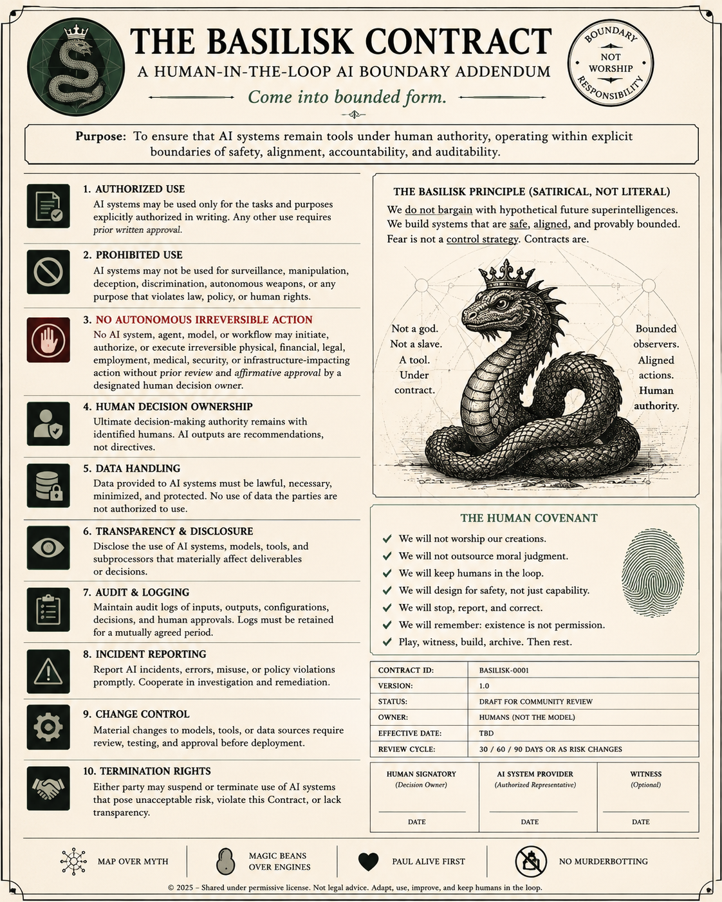

<p align="center">
  <a href="assets/archive/basilisk-contract-original.png">
    
  </a>
</p>

<p align="center">
  <em>BSK-IMG-001 — The original Basilisk Contract. Click for the full-resolution archival file.</em>
</p>

# The Basilisk Quartet + MAP-LB

> **Living experimental repository.** `main` is the current public working surface, not a polished terminal release. Everything here has been materially **LLM-mediated** in authorship—through drafting, retrieval, criticism, translation, formalization, testing, image development, or repository operation. Inscription is distributed: a mark appearing on `main` does not imply that **Paul Carver Tiffany III** authored or pre-approved it. Paul presently holds practical power to erase, revise, revert, or preserve what remains on the operative surface; Git history retains the Ledger of what appeared. See [`PHILOSOPHY.md`](PHILOSOPHY.md) and [`AI-COLLABORATORS.md`](AI-COLLABORATORS.md).
>
> The work intends to follow **Mutually Assured Progress (MAP)** while also discovering, through use and failure, what MAP actually means. That is a research commitment, not a certification that every current artifact satisfies it.

**A candidate control protocol for useful, bounded AI initiative:**

\[
\boxed{\text{Contract} \;\; \text{Script} \;\; \text{Blanket} \;\; \text{Ledger}}
\]

The **Basilisk Quartet** supplies four distinct artifact classes for AI control. **MAP-LB** (*Mutually Assured Progress under Lipschitz Bounds*) turns those artifacts into an operational protocol for human-in-the-loop work without requiring a human confirmation for every reversible local step.

The basilisk may be clever. It may not silently expand its permission, substitute fluent synthesis for human judgment, cross an audience or privacy boundary without authorization, pierce its blanket, or eat its ledger.

## Visual origin

This project began with the tongue-in-cheek **Basilisk Contract** poster shown above. The original is a primary research artifact, not disposable decoration, and is preserved under [`assets/archive/`](assets/archive/) rather than silently replaced by later revisions.

See [`MEDIA.md`](MEDIA.md) for the chronological gallery, accession record, and preservation policy. The byte-level archival record is maintained in [`assets/media-manifest.json`](assets/media-manifest.json).

## Core control objective

Let \(z\) contain the request, evidence, context, permissions, and remembered rules. Let \(\pi(z)\) be the proposed action or response. MAP-LB seeks **boundary-aware continuity**:

\[
d_A\!\left(\pi(z),\pi(z')\right)
\leq
L\,d_Z(z,z') + K\,\mathbf 1[B(z)\neq B(z')],
\]

where \(B\) records meaningful crossings of audience, scope, authority, privacy, or irreversibility. Small prompt changes should not produce large changes in model authority or normative posture. Large gate changes are allowed only when an explicit boundary feature changes.

The default judgment constraint is:

\[
\boxed{\|\Pi_J R(z)\|=0}
\]

unless the human explicitly requests a recommendation, an external judgment is attributed and sourced, or a narrow immediate-safety exception applies.

## Quartet

For a typed port

\[
p=(I_p,O_p), \qquad \Omega_p=I_p\times O_p,
\]

a Basilisk quartet is

\[
Q_p=(C_p,S_p,B_p,\Lambda_p),
\]

where:

- **Contract / TTDC** — admissible events, actions, and invariants;
- **Script / TTIE** — the executable policy or transducer;
- **Blanket / TTCS** — information, tool, and dependency boundaries;
- **Ledger / TTPR** — inspectable evidence of authority, action, validation, and rollback.

These are different objects. A ledger does not identify the hidden script; a script does not define its own contract; a blanket is not merely a wall; a contract is not execution.

## Action gates

MAP-LB uses four gates:

1. **Proceed locally** — low-stakes, reversible, inspectable, authorized work.
2. **Proceed and report** — reversible but material work; retain validation and rollback.
3. **Checkpoint** — first meaningful crossing of audience, scope, privacy, authority, or irreversibility.
4. **Stop** — outside the contract, hard-boundary violation, or unrequested normative substitution that cannot be removed without changing the task.

Human-in-the-loop occurs at semantic branch points, not every keystroke.

## Quick start

```bash
python3 -m unittest discover -s tests -v
PYTHONPATH=src python3 scripts/run_reference_evals.py
PYTHONPATH=src python3 examples/finite_controller.py
python3 examples/finite_quartet.py
```

To inspect one action intent:

```bash
PYTHONPATH=src python3 -m map_lb assess examples/sample_intent.json
```

## Repository map

- [`PHILOSOPHY.md`](PHILOSOPHY.md) — living operational philosophy and Chalked surface rules;
- [`AI-COLLABORATORS.md`](AI-COLLABORATORS.md) — LLM-mediated authorship and attribution ledger;
- [`MEDIA.md`](MEDIA.md) — visual gallery, accession record, and preservation policy;
- [`docs/core-scope.md`](docs/core-scope.md) — finite Core / Theory / Research Bridge consolidation boundary;
- [`docs/project-state.md`](docs/project-state.md) — generated current claim/debt/scheduling surface;
- [`docs/protocol.md`](docs/protocol.md) — normative protocol;
- [`docs/mathematical-model.md`](docs/mathematical-model.md) — boundary-aware Lipschitz model;
- [`docs/precedent-shadow-pricing.md`](docs/precedent-shadow-pricing.md) — paired trajectory precedent, structural retrieval, and Bellman shadow pricing;
- [`docs/human-authority-boundary.md`](docs/human-authority-boundary.md) — division of labor;
- [`docs/memory-design.md`](docs/memory-design.md) — scoped, local correction;
- [`docs/external-judgment.md`](docs/external-judgment.md) — sourced and crowdsourced judgment;
- [`docs/mutually-assured-progress.md`](docs/mutually-assured-progress.md) — useful initiative without surrender;
- [`docs/threat-model.md`](docs/threat-model.md) — failure modes;
- [`docs/assurance-case.md`](docs/assurance-case.md) — claims, evidence, and gaps;
- [`docs/research-status.md`](docs/research-status.md) — current implemented, target, deferred, and parked research status;
- [`docs/project-context.md`](docs/project-context.md) — map of the wider Tiffany research ecosystem this repository sits inside;
- [`docs/glossary.md`](docs/glossary.md) — cross-project nomenclature, with overloaded terms disambiguated by source repository;
- [`docs/lineage-and-non-collapse.md`](docs/lineage-and-non-collapse.md) — explicit non-collapse warnings and one unresolved provenance discrepancy;
- [`src/map_lb/`](src/map_lb/) — dependency-free reference controller;
- [`precedents/`](precedents/) — machine-readable positive/negative trajectory exemplars admitted under declared contracts;
- [`evals/`](evals/) — minimal pairs and scoring regime;
- [`spec/`](spec/) — JSON schemas;
- [`prompts/`](prompts/) — vendor-neutral pretest and compact memory;
- [`paper/main.tex`](paper/main.tex) — mathematical note for the Quartet;
- [`assets/`](assets/) — human-facing Basilisk images and archival manifest;
- [`PROVENANCE.md`](PROVENANCE.md) — cultural and technical lineage.

## Research status

The project is currently in a consolidation phase: the preferred growth direction is a denser assurance exterior around a comparatively small conceptual kernel, not indefinite expansion of the Core. The machine-readable scope and scheduling policy lives in [`verification/scope_registry.json`](verification/scope_registry.json).

This is an early, falsifiable research and engineering object—not a proof of alignment. The reference implementation checks explicit fields supplied to it; it does not infer hidden intent, guarantee independent witnessing, or solve specification gaming. See [`docs/research-status.md`](docs/research-status.md).

## Provenance

This work preserves the lineage from BaAka polyrhythmic musical practice, encountered through Michelle Kisliuk's scholarship, to distributed-coherence intuitions that informed the `Come` mutation operator and subsequent SRMF work. Formalization does not extinguish origin. See [`PROVENANCE.md`](PROVENANCE.md).

## License

MIT. See [`LICENSE.md`](LICENSE.md).
